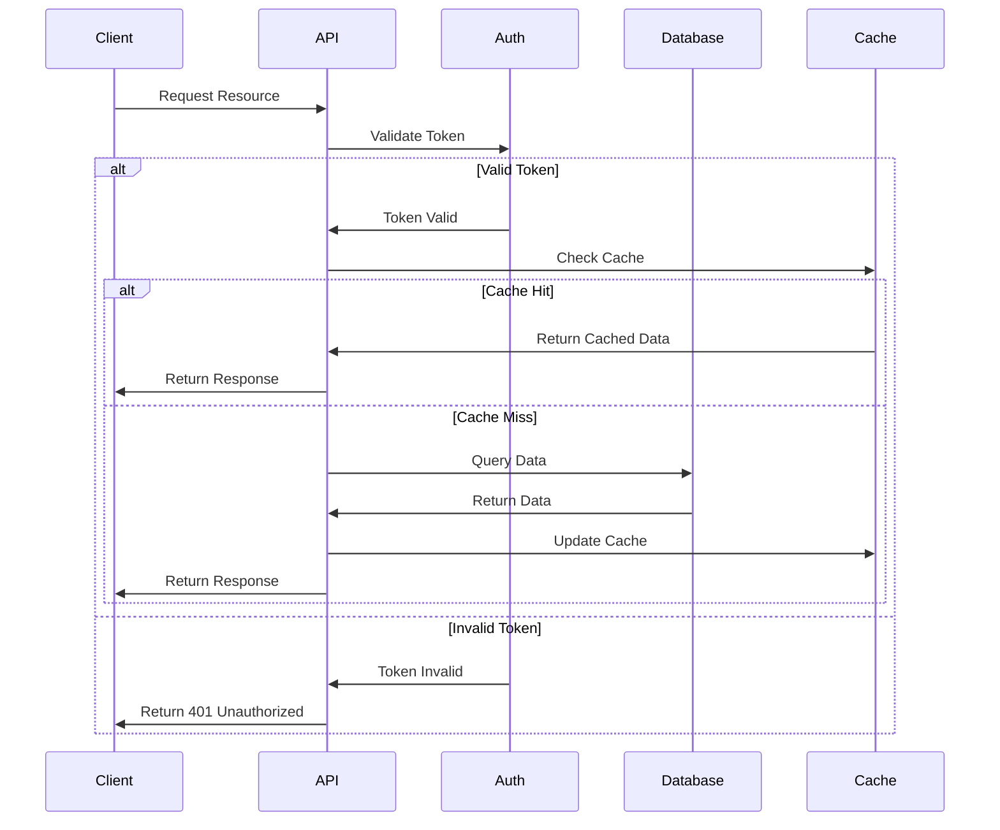

```mermaid
sequenceDiagram
    participant Client
    participant API
    participant Auth
    participant Database
    participant Cache
    
    Client->>API: Request Resource
    API->>Auth: Validate Token
    
    alt Valid Token
        Auth->>API: Token Valid
        API->>Cache: Check Cache
        
        alt Cache Hit
            Cache->>API: Return Cached Data
            API->>Client: Return Response
        else Cache Miss
            API->>Database: Query Data
            Database->>API: Return Data
            API->>Cache: Update Cache
            API->>Client: Return Response
        end
    else Invalid Token
        Auth->>API: Token Invalid
        API->>Client: Return 401 Unauthorized
    end
```