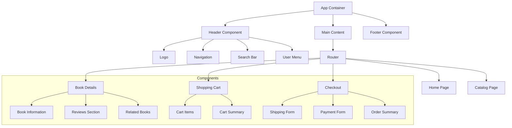

```mermaid
graph TD
    App[App Container] --> Header[Header Component]
    App --> Main[Main Content]
    App --> Footer[Footer Component]
    
    Header --> Logo[Logo]
    Header --> Nav[Navigation]
    Header --> Search[Search Bar]
    Header --> UserMenu[User Menu]
    
    Main --> Router[Router]
    Router --> Home[Home Page]
    Router --> Catalog[Catalog Page]
    Router --> Book[Book Details]
    Router --> Cart[Shopping Cart]
    Router --> Checkout[Checkout]
    
    subgraph Components
        Book --> BookInfo[Book Information]
        Book --> Reviews[Reviews Section]
        Book --> Related[Related Books]
        
        Cart --> CartItems[Cart Items]
        Cart --> CartSummary[Cart Summary]
        
        Checkout --> ShippingForm[Shipping Form]
        Checkout --> PaymentForm[Payment Form]
        Checkout --> OrderSummary[Order Summary]
    end
```