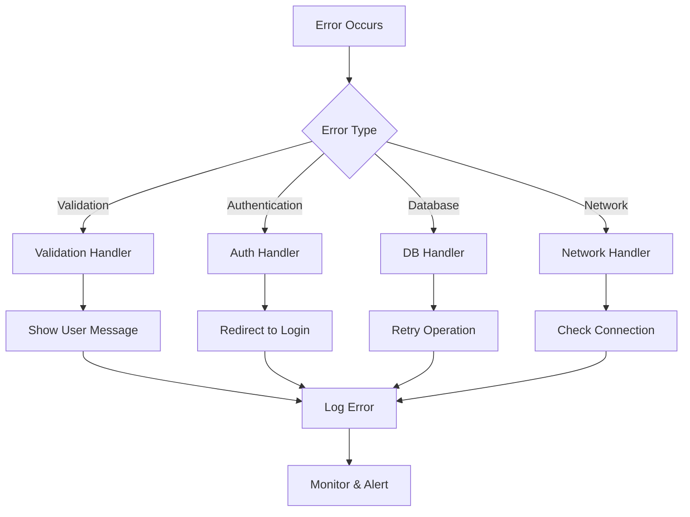

```mermaid
graph TD
    Error[Error Occurs] --> Type{Error Type}
    
    Type -->|Validation| HandleValidation[Validation Handler]
    Type -->|Authentication| HandleAuth[Auth Handler]
    Type -->|Database| HandleDB[DB Handler]
    Type -->|Network| HandleNetwork[Network Handler]
    
    HandleValidation --> ShowUser[Show User Message]
    HandleAuth --> RedirectLogin[Redirect to Login]
    HandleDB --> RetryOperation[Retry Operation]
    HandleNetwork --> CheckConnection[Check Connection]
    
    ShowUser --> Log[Log Error]
    RedirectLogin --> Log
    RetryOperation --> Log
    CheckConnection --> Log
    
    Log --> Monitor[Monitor & Alert]
```