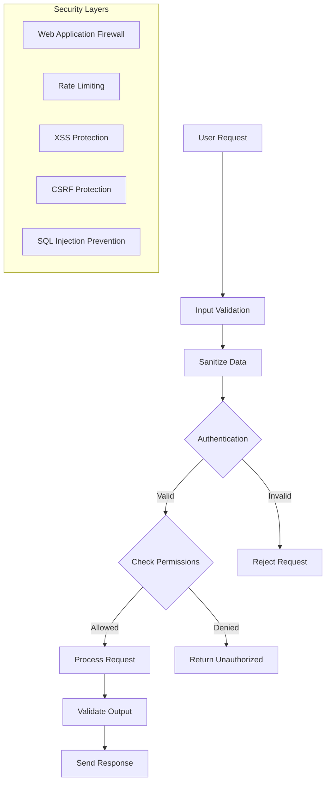

```mermaid
graph TD
    Request[User Request] --> ValidateInput[Input Validation]
    ValidateInput --> Sanitize[Sanitize Data]
    Sanitize --> Auth{Authentication}
    
    Auth -->|Valid| CheckPermission{Check Permissions}
    Auth -->|Invalid| Reject[Reject Request]
    
    CheckPermission -->|Allowed| ProcessRequest[Process Request]
    CheckPermission -->|Denied| Unauthorized[Return Unauthorized]
    
    ProcessRequest --> ValidateOutput[Validate Output]
    ValidateOutput --> Respond[Send Response]
    
    subgraph Security Layers
        WAF[Web Application Firewall]
        RateLimit[Rate Limiting]
        XSS[XSS Protection]
        CSRF[CSRF Protection]
        SQL[SQL Injection Prevention]
    end
```