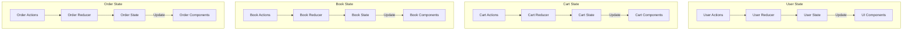

```mermaid
graph TD
    subgraph User State
        UserActions[User Actions] --> UserReducer[User Reducer]
        UserReducer --> UserState[User State]
        UserState --> |Update| UI[UI Components]
    end
    
    subgraph Cart State
        CartActions[Cart Actions] --> CartReducer[Cart Reducer]
        CartReducer --> CartState[Cart State]
        CartState --> |Update| CartUI[Cart Components]
    end
    
    subgraph Book State
        BookActions[Book Actions] --> BookReducer[Book Reducer]
        BookReducer --> BookState[Book State]
        BookState --> |Update| BookUI[Book Components]
    end
    
    subgraph Order State
        OrderActions[Order Actions] --> OrderReducer[Order Reducer]
        OrderReducer --> OrderState[Order State]
        OrderState --> |Update| OrderUI[Order Components]
    end
```