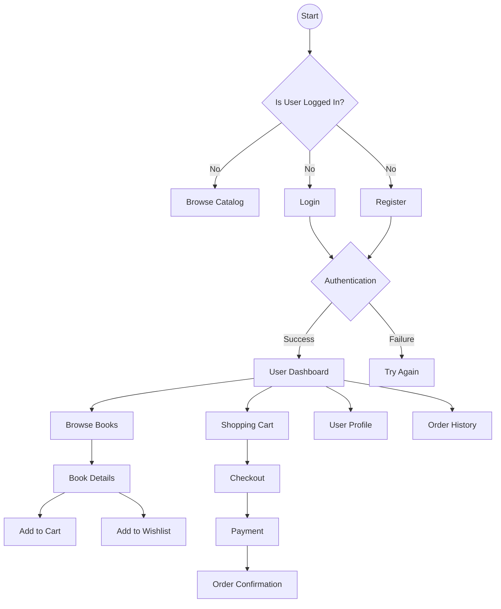
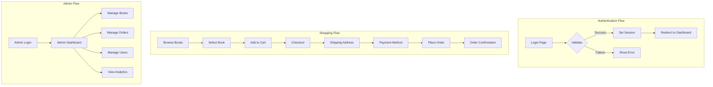

```mermaid
graph TD
    Start((Start)) --> Guest{Is User Logged In?}
    Guest -->|No| BrowseAsGuest[Browse Catalog]
    Guest -->|No| Login[Login]
    Guest -->|No| Register[Register]
    
    Login --> Auth{Authentication}
    Register --> Auth
    
    Auth -->|Success| Dashboard[User Dashboard]
    Auth -->|Failure| RetryAuth[Try Again]
    
    Dashboard --> Browse[Browse Books]
    Dashboard --> Cart[Shopping Cart]
    Dashboard --> Profile[User Profile]
    Dashboard --> Orders[Order History]
    
    Browse --> BookDetails[Book Details]
    BookDetails --> AddToCart[Add to Cart]
    BookDetails --> AddToWishlist[Add to Wishlist]
    
    Cart --> Checkout[Checkout]
    Checkout --> Payment[Payment]
    Payment --> OrderConfirm[Order Confirmation]
```

```mermaid
graph TD
    subgraph Authentication Flow
        Login[Login Page] --> ValidateCredentials{Validate}
        ValidateCredentials -->|Success| SetSession[Set Session]
        ValidateCredentials -->|Failure| ShowError[Show Error]
        SetSession --> Redirect[Redirect to Dashboard]
    end
    
    subgraph Shopping Flow
        Browse[Browse Books] --> Select[Select Book]
        Select --> Cart[Add to Cart]
        Cart --> Checkout[Checkout]
        Checkout --> Address[Shipping Address]
        Address --> Payment[Payment Method]
        Payment --> PlaceOrder[Place Order]
        PlaceOrder --> Confirmation[Order Confirmation]
    end
    
    subgraph Admin Flow
        AdminLogin[Admin Login] --> Dashboard[Admin Dashboard]
        Dashboard --> ManageBooks[Manage Books]
        Dashboard --> ManageOrders[Manage Orders]
        Dashboard --> ManageUsers[Manage Users]
        Dashboard --> Analytics[View Analytics]
    end
```